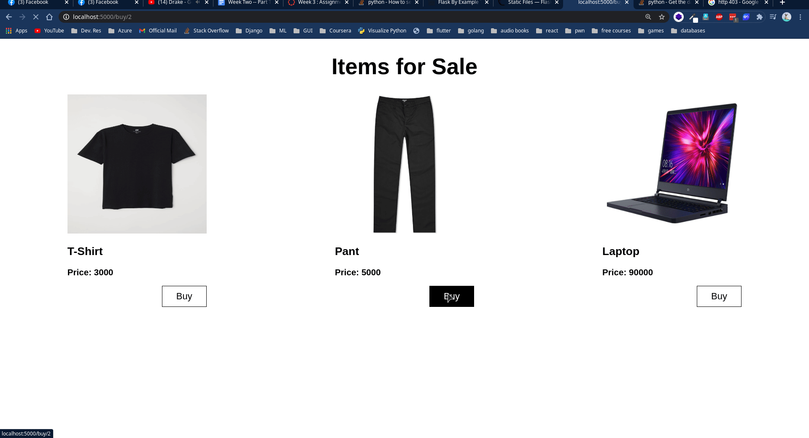

# Mock Ecommerce 

This is a only frontend-static application for microservice.

## Installation

Make sure you have nginx installed.

Or run `python -m http.server` and you're good to go.

## Contributing
Pull requests are welcome. For major changes, please open an issue first to discuss what you would like to change.

## Screenshot

## License
[MIT](https://choosealicense.com/licenses/mit/)